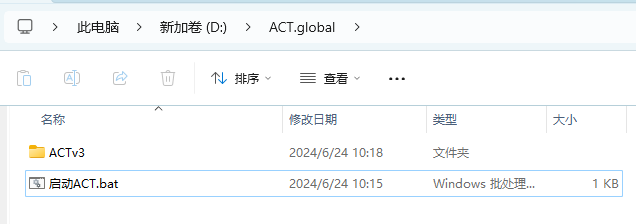
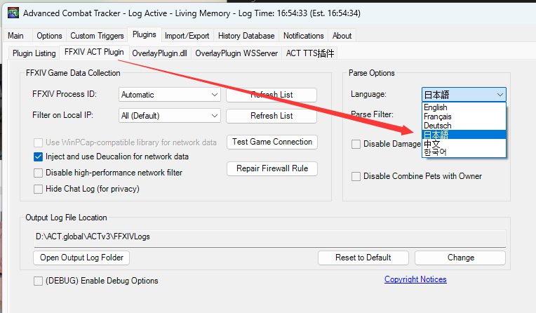

# act.global-quickstart

国际服原生ACT快速开始

## 快速开始

1. 下载最新 [Release 版本](https://github.com/Souma-Sumire/act.global-quickstart/releases/latest)

1. 将其解压至 `D:\ACT.global` 

1. 运行 `启动ACT.bat`

1. 若你使用日文客户端游玩，则将这里修改为日本语并重启ACT 

1. 所有插件均会自动检测更新，除非你连不上Github

如果你的网络无法连接Github，并且你也不懂如何配置代理，请去使用 [ACT.呆萌.非绿色化整合](https://nga.178.com/read.php?tid=19019884)
